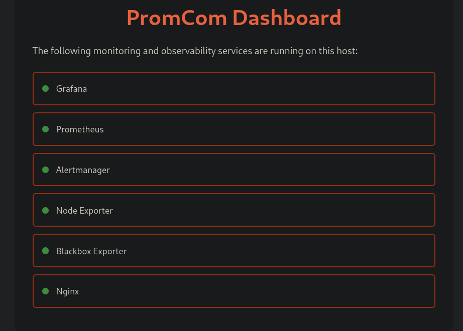

# PromCom - Prometheus / docker-compose / AWS CloudFormation

Prometheus is an open source metrics collection system (and much more).

This project provides a simple way to deploy Prometheus and related services to AWS
for learning and experimentation.



## Quick Start

```shell
git clone https://github.com/mbailey/promcom.git
cd promcom
docker-compose up -d
```

Then open http://localhost:8080 in your browser to access the services dashboard.

- **Prometheus**: Time series database to collect (pull) metrics from systems and services.
- **Blackbox Exporter**: Makes requests (http/https, ping, other) on behalf of Prometheus
- **Grafana**: Web based data visualisation tool.
- **Alertmanager**: Monitoring and alerting service distributed with Prometheus

All of the components are free and open source. A benefit of using open source
software is that we are not restricted by licensing.

Inspired by <https://github.com/vegasbrianc/prometheus>

## Installation

See [INSTALL.md](INSTALL.md)

## Development

This is a spike and as such, only has the level of automation and documentation
required for a prototype. That being said, configuration as code and automated
deployment still has a place during experimentation. The intention is that this
repo will be useful as a learning/teaching tool.

The services are run from a [docker-compose script](docker-compose.yml) that
uses configuration from this repo. It's been deployed using CloudFormation
templates which live in [cloudformation/](cloudformation).

## How to expose a metric to Prometheus from your application

Prometheus is configured with EC2 Service discovery so requires no extra configuration to
pull metrics from your service that runs in EC2. Simply tag your application instances,
make them accessible from the Prometheus instance running in the private subnet and tag
your instances.

1. **Expose metrics from an endpoint in your application**

    There are a number of clients available to make simplify exposing metrics:
      - [Java/Scala Client][java-client]: It supports Java, Clojure, Scala, JRuby, and anything else that runs on the JVM.
      - [other clients][other-clients]: such as Bash, Go, Node.js, Python, Ruby, Rust

    The default convention is to expose metrics (in [prometheus format][prom-format]) at `/metrics`.

1. **Grant Prometheus EC2 instance access to scrape your instances**

   - you could grant access to Prometheus's SecurityGroup (obtain with `stack-outputs $STACKNAME`)
   - alternatively grant access to private subnet (less secure/restrictive)

1. **Tag your application's EC2 instances**

    Prometheus service discovery (SD) monitors EC2 instances every minute and will
    scrape any instance with a Tag whose name starts with `prometheus`. You may as
    well add both of the tags below to make it more obvious to people where to find the endpoint.

    Tag Name        | Value    | Description
    ---             | ---      | ---
    prometheus_port | 80       | Port Prometheus should scrape on
    prometheus_path | /metrics | Endpoint path for Prometheus to scrape

1. **Check the "Target List" in Prometheus web interface to see scrape status.**

## How to chart a metric from Prometheus in Grafana

1. Login to Grafana (default login is admin/foobar)

1. Create a dashboard or add a panel to an existing dashboard and create your chart.

[java-client]: https://github.com/prometheus/client_java
[other-clients]: https://prometheus.io/docs/instrumenting/clientlibs/
[prom-format]: https://github.com/prometheus/docs/blob/master/content/docs/instrumenting/exposition_formats.md
## Host Metrics Collection
This setup supports collecting metrics from the host machine in multiple environments:

- Docker Desktop (Mac/Windows): Uses `host.docker.internal`
- Podman: Uses `host.containers.internal`
- Linux with Docker: Uses host gateway mapping
- Alternative: Can use host network mode by uncommenting `network_mode: "host"` in docker-compose.yml

If you experience connectivity issues, try one of these approaches:
1. Use the default configuration
2. Uncomment the `network_mode: "host"` line in docker-compose.yml and comment out the ports/networks sections
3. Replace the hostname with your actual host IP address
